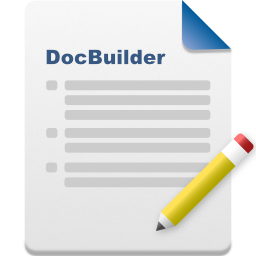
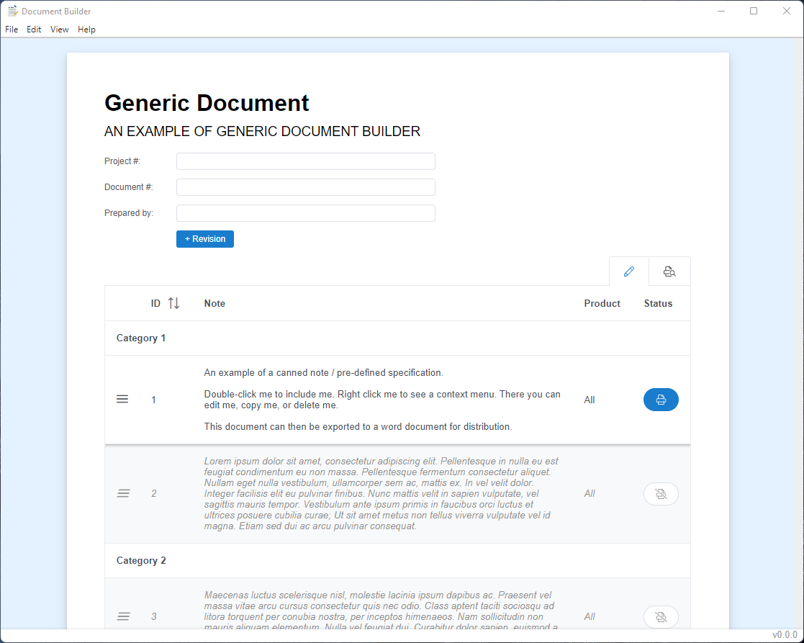

    

# Generic Document Builder

A simple Electron + Vue.js application to quickly build documents from a collection of predefined notes and specifications.

## Screenshot

## Stack

- Electron
- Vue.js
- Vite
- Element Plus - Component Library
- PrimeVue - Component Library
- Font Awesome - Icon Library
